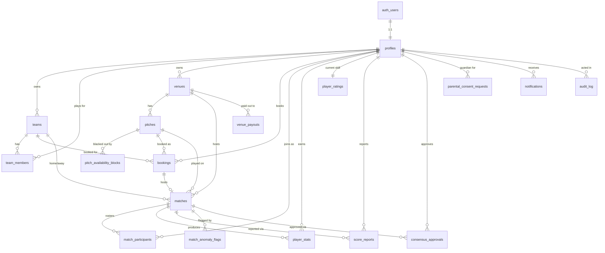

# OnPitch — Data Model

Reference for `supabase/migrations/0001_schema.sql` (19 tables, 9 enums). Money is **integer
minor units** (`*_minor`, kuruş). All timestamps are `timestamptz`. Ranges are `tstzrange`,
half-open `[start, end)`.

---

## Entity relationships



The six progression tables added by `0008_gamification.sql` — `player_progress`, `xp_events`,
`achievements`, `player_achievements`, `challenges`, `challenge_progress` — are documented in
`docs/PROGRESSION.md` rather than here, because what matters about them is a set of rules
(XP is ledger-derived, counters are recomputed, levels are generated) and not a shape.

Two of them belong in the invariants table below in spirit: `player_progress.level` is
`GENERATED ALWAYS AS (private.level_for_xp(xp)) STORED`, so a level can never disagree with its
XP; and `xp_events` carries a partial unique index on `(user_id, dedupe_key)`, which is what makes
every award idempotent and every trigger safe to re-run.

The three league tables added by `0009_leagues.sql` — `league_seasons`, `league_entries`,
`league_results` — are documented in `docs/LEAGUES.md`. Two of their invariants belong in the
table below in spirit: `league_entries.points` and `.goal_difference` are GENERATED STORED, so a
standings row cannot disagree with its results; and `league_results.match_id` is the primary key,
which makes counting a match twice impossible rather than merely unlikely.

`stripe_events` stands alone — it is the webhook idempotency ledger, keyed by the Stripe event
id, with no foreign keys by design.

---

## Enums

| Enum | Values |
|---|---|
| `app_role` | `admin` · `venue_owner` · `player` |
| `consent_status` | `not_required` · `pending` · `granted` · `revoked` |
| `booking_status` | `pending` · `awaiting_payment` · `confirmed` · `cancelled` · `refunded` · `disputed` · `completed` |
| `payment_status` | `requires_payment` · `processing` · `succeeded` · `failed` · `refunded` · `partially_refunded` |
| `match_status` | `scheduled` · `live` · `awaiting_report` · `requires_consensus` · `disputed` · `finalized` · `cancelled` |
| `match_format` | `five_a_side` · `six_a_side` · `seven_a_side` · `eight_a_side` · `eleven_a_side` |
| `pitch_surface` | `natural_grass` · `artificial_turf` · `hybrid` · `indoor_court` |
| `team_member_role` | `captain` · `vice_captain` · `member` |
| `payout_status` | `pending` · `in_transit` · `paid` · `failed` |

---

## Invariants the database enforces

Each of these holds against a direct `psql` session, with no application code in the path.

| Constraint | Table | What it guarantees |
|---|---|---|
| `bookings_no_double_booking` — `EXCLUDE USING gist (pitch_id WITH =, time_range WITH &&) WHERE status IN ('pending','awaiting_payment','confirmed','completed')` | `bookings` | A pitch cannot be double-booked under any concurrency. Cancelled/refunded/disputed bookings release the slot. Callers must map SQLSTATE **`23P01`** to a 409. |
| `pitch_blocks_no_overlap` — `EXCLUDE USING gist` | `pitch_availability_blocks` | Blackout windows cannot overlap. |
| `profiles_minor_privacy_locked_check` | `profiles` | A minor can never have `location_sharing_enabled = true`, `profile_visibility = 'public'`, or `marketing_opt_in = true`. |
| `bookings_fee_within_total_check` | `bookings` | `platform_fee_minor <= total_minor` — the application fee can never exceed the charge. |
| `bookings_refund_within_total_check` | `bookings` | Cannot refund more than was charged. |
| `matches_distinct_teams_check` | `matches` | A team cannot play itself. |
| `stripe_events.id` primary key | `stripe_events` | Webhook exactly-once processing: a duplicate event id conflicts on insert. |
| `score_reports_unique (match_id, reported_by)` | `score_reports` | One report per person per match. |
| `consensus_approvals_unique (match_id, approver_id)` | `consensus_approvals` | One vote per person per round. |
| `parental_consent_requests.token_hash` unique | `parental_consent_requests` | Consent tokens are stored hashed, never raw. |

---

## Generated columns — never write these

| Column | Type & expression | Note |
|---|---|---|
| `profiles.is_minor` | `boolean`, `private.is_minor_dob(date_of_birth)` STORED | Postgres requires IMMUTABLE generated expressions and `current_date` is only STABLE, so the predicate is wrapped in an immutable helper. The value is therefore a write-time snapshot: a player who turns 16 stays flagged until their row is rewritten. That errs protective, and a nightly re-touch job is what releases aged-out accounts. |
| `player_ratings.conservative_rating` | `double precision`, `mu - 3*sigma` STORED | Indexed descending as `idx_player_ratings_conservative` — the leaderboard sort key. |
| `player_stats.rating_delta` | `double precision`, `mu_after - mu_before` STORED | Per-match rating movement. Null until the rating update runs. |
| `audit_log.id` | `bigint GENERATED ALWAYS AS IDENTITY` | Primary key. |

They are omitted from the `Insert` and `Update` types in `packages/shared/src/database.ts` —
including them would let TypeScript bless a write Postgres will reject.

---

## The two rating tables

| | `player_ratings` | `player_stats` |
|---|---|---|
| Grain | one row per player | one row per (player, match) |
| Mutability | updated after every rated match, and by the decay cron | append-only history |
| Holds | current `mu`, `sigma`, `conservative_rating`, W/D/L, `last_match_at`, `last_decay_at` | goals, assists, cards, minutes, and `mu_before/sigma_before/mu_after/sigma_after` |
| Purpose | matchmaking, leaderboards | audit trail — every rating change is replayable and reversible when a match is later disputed |

`mu` and `sigma` are `double precision`, defaulting to 25.0 and 8.333333333333334 (25/3), the
TrueSkill prior. `numeric` is used elsewhere in the schema only where a value is bounded and
displayed: `venues.latitude/longitude` are `numeric(9,6)`, and the quality, probability and
anomaly scores are `numeric(6,5)` / `numeric(8,6)`.

---

## Lifecycle: booking → match → rating

```
1  POST /api/bookings/checkout
     ├─ INSERT bookings (status='awaiting_payment')   ← exclusion constraint reserves the slot
     └─ stripe.paymentIntents.create(application_fee_amount, transfer_data.destination)

2  webhook payment_intent.succeeded
     └─ bookings.status='confirmed', payment_status='succeeded'

3  POST /api/matches                       matches.status='scheduled'
4  kickoff                                 matches.status='live'   → realtime broadcast
5  POST /api/matches/[id]/report-score     INSERT score_reports    → rule-engine trigger
     └─ evaluate_score_consensus()
          ├─ both sides agree      → status='finalized'
          └─ disagree / anomalous  → requires_consensus=true, consensus_deadline=+24h

6  anomaly check (Isolation Forest, advisory)  → match_anomaly_flags
7  peer consensus (if flagged)
     └─ submit_consensus_approval(digest)  → finalize_consensus() on ⌈2/3⌉ quorum, both sides

8  apply_match_rating()                    ← idempotent, gated on rating_applied_at IS NULL
     ├─ trueskill2_update()                → player_ratings (mu, sigma)
     └─ player_stats.mu_before/after, sigma_before/after

9  nightly  decay_inactive_ratings()       → sigma grows for players idle > 30 days
```

An abandoned checkout never reaches step 2 and emits no Stripe event, so
`POST /api/internal/bookings/expire-reservations` cancels the PaymentIntent and then releases
the `awaiting_payment` row, which is what returns the slot to the exclusion predicate.

---

## Index strategy

Every foreign key and every column an RLS policy filters on carries a named B-Tree index — a
correctly hoisted policy still sequential-scans if the compared column is unindexed. CI fails
the build on a foreign key whose leading column heads no index.

Beyond that:

- **GiST** on `bookings.time_range`, `(pitch_id, time_range)`, and
  `pitch_availability_blocks.block_range` — backs the exclusion constraints and range overlap queries.
- **Partial** indexes where the hot query is a slice: `idx_bookings_active_status`
  (pending/awaiting_payment/confirmed), `idx_matches_pending_rating`
  (`rating_applied_at IS NULL AND is_ranked`), `idx_notifications_user_unread`
  (`read_at IS NULL`), `idx_stripe_events_unprocessed`, `idx_profiles_is_minor`.
- **Composite** where the access pattern is compound: `idx_matches_status_kickoff_at`,
  `idx_pitches_venue_active`, `idx_audit_log_entity (entity_type, entity_id)`.
- **Descending** on `player_ratings.conservative_rating` for the leaderboard.
- `idx_player_ratings_last_match_at` / `last_decay_at` — the decay cron's scan path.
